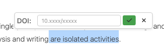
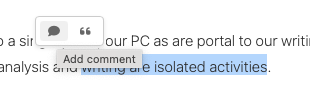
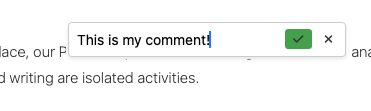
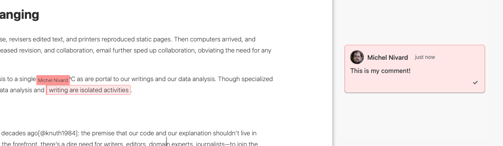
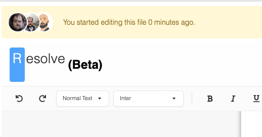
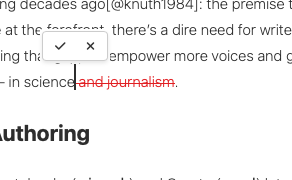
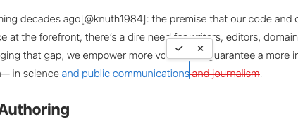
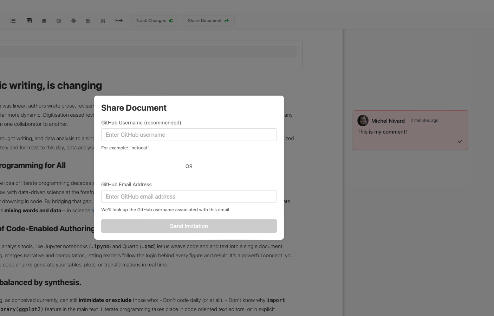

# Guide: Working with Documents in Resolve

## Setup Requirements

1. Your document must be in a GitHub repository

2. Your document should be either:
   - A Jupyter notebook (`.ipynb`)
   - A Quarto markdown document converted to `.ipynb` format

3. If you have a bibliography, the bibliography file ***must*** be named `references.bib` and ***must*** be located in the same directory as your notebook/document

## GitHub Integration Process

### Initial Setup
1. Log into Resolve using GitHub OAuth authentication
2. Select your repository from the available list
3. Select the ducument within your repository
4. The system will automatically load any existing `references.bib` file
5. If you want to shared a document with others, click the "Share" button.

### File Management
1. **Creating/Opening Documents**
   - Select your repository
   - Choose an existing notebook or create a new one
   - The system will automatically load any existing `references.bib` file

2. **Saving Changes**
   - Changes are saved directly to GitHub
   - The system maintains version control through GitHub's commit system

## Working with Citations

### Bibliography Management

1. The system will automatically detect and load the bibliography
2. If you cite a DOI, the system will automatically update your `references.bib` file on GitHub

### Adding Citations
1. While editing, use the citation tool in the WYSIWYG editor
2. You can:
   - Select text to add a citation (selections will have a "cite" and "comment" button hovering over them)
   - Enter a valid DOI to automatically add a reference 
   - The system will automatically update your `references.bib` file

   

   
   

### Citation Syntax
1. In markdown cells:
   - Use standard markdown citation syntax: `[@citation-key]`
   - For multiple citations: `[@key1; @key2]`
   - For citations with page numbers: `[@key1, p. 23]`

## Commenting
1. Use the comment tool in the WYSIWYG editor
2. You can:
   - Select text and a comment icon will appear

   

   
   

   - Enter your comment in the textfield

   

   
   

   - The comment will be added to the selected text and appear in the sidebar.

   

   
   

## Collaboration Features

### Important Note on Collaborative Editing
Resolve does **not** support simultaneous collaborative editing. Instead:
- The system displays other users who are currently viewing the document
- This presence detection helps prevent concurrent editing conflicts
- Only one user should edit the document at a time

### Track Changes
1. **Activating Track Changes**
   - Click the "Track Changes" toggle in the editor toolbar
   - When activated, all your edits will be marked as suggestions
   - Track changes mode is indicated by a highlighted icon in the toolbar

   

   
   

2. **Working with Track Changes**
   - Added text appears in a different color (in blue)
   - Deleted text appears struck through (in red)

3. **Reviewing Changes**

   - For each change, you can:
     - Accept the change (incorporates it into the document)
     - Reject the change (removes the suggestion)

### Sharing Documents
1. Use the Share button in the editor toolbar
2. You can:
   - Invite collaborators through GitHub Usernames
   - Share direct links to the document

## Best Practices
1. Always ensure your `references.bib` file is up to date
2. Commit changes regularly
3. Use track changes when working with collaborators
4. Resolve comments once they've been addressed
5. Be aware of other users viewing the document to avoid editing conflicts

## Technical Notes
- The system automatically handles file conversion between formats
- Bibliography updates are managed through the backend API
- All changes are version-controlled through GitHub
- The editor provides WYSIWYG markdown editing with math equation support
